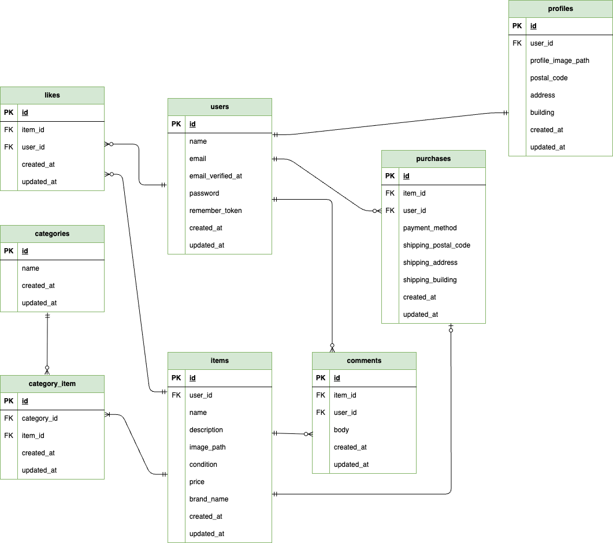

# coachtechフリマ

## 環境構築

### Dockerビルド

1. リポジトリをクローン

```bash
git clone https://github.com/keiko788/flea-market-app.git
```
2. プロジェクトディレクトリへ移動

```bash
cd flea-market-app
```
3. Composerパッケージをインストール

```bash
docker run --rm \
    -u "$(id -u):$(id -g)" \
    -v "$(pwd):/var/www/html" \
    -w /var/www/html \
    -e COMPOSER_CACHE_DIR=/tmp/composer_cache \
    laravelsail/php82-composer:latest \
    composer install
```

4. `.env` ファイル作成

```bash
cp .env.example .env
```
`.env` ファイルを作成後、以下の設定を確認してください。

```env
DB_CONNECTION=mysql
DB_HOST=mysql
DB_PORT=3306
DB_DATABASE=laravel
DB_USERNAME=sail
DB_PASSWORD=password
```

5. Sailを起動

```bash
./vendor/bin/sail up -d --build
```


### Laravel環境構築

1. アプリケーションキー作成

```bash
./vendor/bin/sail artisan key:generate
```

2. マイグレーションを実行

```bash
./vendor/bin/sail artisan migrate:fresh
```

※ 既存テーブルを削除して再作成します。

3. シーディングを実行

```bash
./vendor/bin/sail artisan db:seed
```

※ ダミーデータを投入します。

4. シンボリックリンクを作成

```bash
./vendor/bin/sail artisan storage:link
```
※ 商品画像・プロフィール画像を表示するために必要です。

5. フロントエンド依存パッケージをインストール

```bash
./vendor/bin/sail npm install
```

6. Vite開発サーバーを起動

```bash
./vendor/bin/sail npm run dev
```


## 使用技術

- PHP 8.5
- Laravel 10.x
- MySQL 8.4
- Docker
- Laravel Sail
- phpMyAdmin
- MailHog
- Tailwind CSS 3.x
- Vite 5.0.0
- Laravel Fortify 1.x
- Stripe PHP 20.x


## ER図



## URL


### 開発環境

- 商品一覧画面
    - http://localhost
- ユーザー登録
    - http://localhost/register
- phpMyAdmin
    - http://localhost:8080
- MailHog
    - http://localhost:8025/

# 補足

- メール認証確認は MailHog を使用してください。
- Stripe決済機能を利用する場合は、Stripe APIキーの設定が必要です。
